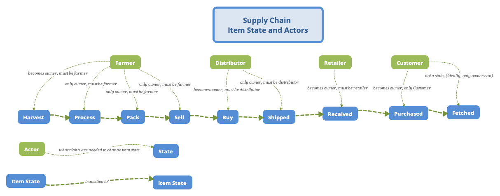
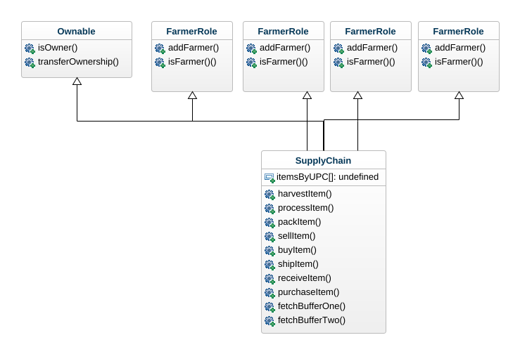

###Audacity Blockchain Developer Project 6 Supply Chain 

Thanks for taking the time to review my work.

 - I found the project interesting as it forced me to analyze, configure, refactor and develop many areas of code, configuration, presentation and 
integration. A good challenge.
 - I also found the project frustrating. I spent minimally 50% of my time fixing Udacity's out-of-date project template codebase. I guess the bright side is that I can now recognize ancient blockchain code and can upgrade it.
 - As a consequence of so much wasted time fixing the project template codebase, I was not able to do the IPFS extension.

Some notes about the project:

1) Migrations.js in its original state contains deployment steps for all contracts, not just SupplyChain. This is strange, as only SupplyChain need be deployed - or I don’t understand contract inheritance. I removed all deploy directives except for SupplyChain
2) My implementation and Sequence Diagram shows Distributor taking ownership at the time of Buy. Shipping, therefore, is not executed by Farmer as can be found in some areas of the Udacity project documentation (can't find right now, may look if you want me to). Therefore, it might be the case that my implementation and state/ownership transitions may not match exactly expected behavior.
3) There is a requirement to inherit from Ownable which I've done. However, the Ownable purpose is not used in this project - or, at least, I could not find the requirement. The purpose of Ownable is to support transfer of Contract ownership (not Item) and I found nothing in the Rubric regarding Contract ownership transfer.
4) I added a number of different tests and renamed most
5) I'm surprised by the strange approach of creating psuedo primary keys using UPC and the hard-coded  values littering the Web App. It's a mess. I decided to toy with this too much, as I am not a HTML/Javascript guy. But, the fragile nature of the Web App made it next to impossible to add subsequent products for testing. My bad for not fixing this poor Web App approach.
6) With Ganache, I got into a habit of quickly pressing Item State transition buttons. At first with Rinkeby, I didn't realize I needed to wait for the transactions to complete before I could transition the Item to the next State and caused some unforced errors.
7) I added two additional Events as can be seen in the following screenshot which allow me to monitor payments and refunds: TomW_ADDED_RefundSent(address purchaser) and TomW_ADDED_PaymentSent(address seller);
8) Some good samaritan or crypto thief emptied my Metamash account and made extended testing on Rinkeby difficult. I imagine the samaritan/thief found my truffle-config.js file and grabbed the Metamask secret phrase. Shame on me. In the screenshot below, you can see my account (0x6e911...) sending all my Rinkeby ether (ETH .27285) to 0xe1c5b...). As you can see, the owner of 0xe1c5b drained other accounts, too, and has done the same to over 450 accounts recently. Not your keys, not your coins. So, what do you think: Samaritan (teach me a lesson) or Crypto Thief (hoping my HD Wallet contained accounts for the Mainnet)?

9) Mystery to me in Etherscan on Rinkeby: why Harvest Item does not show up as the Method invoked on the contract. Other methods, do so I will need to investigate.
Screenshot of Method Name mystery:

   

Here is a screenshot of the contract running successfully locally. Note the two extra Events prepended by TomW_ADDED_:  


Documentation begins with a commented on rubric to track progress State.

###Rubric: Architect a Blockchain Supply Chain Solution - Part B ###
Write Up

| CRITERIA | MEETS SPECIFICATIONS |
| :----- | :----- |
| Project write-up - UML | DONE:  Project write-up include the following UML diagrams: 	•	Activity 	•	Sequence 	•	State 	•	Classes (Data Model)  |
| Project write-up - Libraries | DONE:  If libraries are used, the project write-up discusses why these libraries were adopted.  |
| Project write-up - IPFS | NOT USED, Ran out of Time:  If IPFS is used, the project write-up discusses how IPFS is used in this project.  |
| General Write Up | DONE:  A general write up exists to items like steps and contracts address.  |

**Write smart contracts with functions**

| CRITERIA | MEETS SPECIFICATIONS |
| :----- | :----- |
| SupplyChain.sol contains required tracking functions. | DONE: Smart contract implements functions to track. For example: Product IDProduct UPCOrigination InformationFarmMisc organization infoLongitude & Latitude of geo coordinatesProduct notes  |
| Ownable.sol contains required functions that establish owner and the transfer of ownership. | DONE:  Ownable.sol has required functions that establish owner and the transfer of ownership.  |
| ConsumerRole.sol contains required functions that manage the consumer role. | DONE ConsumerRole.sol has required functions that manage the consumer role. |
| RetailerRole.sol contains required functions that manage the consumer role. | DONE  RetailerRole.sol has required functions that manage the consumer role.  |
| DistributorRole.sol contains required functions that manage the consumer role. | DONE DistributorRole.sol has required functions that manage the consumer role.  |
| Additional roles implemented are integrated correctly. | DONE: Farmer Role is only other Role Student has implemented additional roles correctly.  |

**Test smart contract code coverage**

| CRITERIA | MEETS SPECIFICATIONS |
| :----- | :----- |
| Test smart contract tests all required functions. | DONE: Included is screenshot of Project contains tests for the boiler plate functions and all tests are approved without error. |

**Deploy smart contract on a public test network (Rinkeby)**

| CRITERIA | MEETS SPECIFICATIONS |
| :----- | :----- |
| Deploy smart contract on a public test network. | DONE: Address is 0x6b8Aca345059Ac8E2FD96eD433948979a325b715 Smart contract is deployed on on the Ethereum RINKEBY test network.  |
| Project submission includes transaction ID and contract address | DONE: please see RinkebyAddress.txt Project submission includes a document (.md, .txt) that includes: 	•	Transaction ID 	•	Contract address 	◦	Hint: You can view Transaction ID and Contract ID from a blockchain explorer (e.g. Etherscan). Example Contract ID: https://rinkeby.etherscan.io/address/0xfb0720c0715e68f80c0c0437c9c491abfed9e7ab#code  |

**Modify client code to interact with a smart contract**

| CRITERIA | MEETS SPECIFICATIONS |
| :----- | :----- |
| Client code interacts with smart contract. | DONE: Front-end is configured to: 	•	Submit a product for shipment (farmer to the distributor, distributor to retailer, etc). 	•	Receive product from shipment. 	•	Validate the authenticity of the product.  |

### Supply Chain UML Diagrams
###Activity

###Sequence

###Item State and Actors

###Class


### Contract Deployment to Rinkeby
Rinkeby Contract Details are:  
```
   > transaction hash:    0x5d4c54b19563405a0ca3d265187bd2a178b916a3e753f53149bbb1e2945d6c06
   > contract address:    0xFD0FFa0d71224a9389cf0AEC1aa8dc6Dbb2c3e3F
   > account:             0xDdCaFFa904226131E7F712e75D59D84F68c55819
```

This can also be seen in the following, Migration output by Truffle onto Rinkeby  

```
Starting migrations...
======================
> Network name:    'rinkeby'
> Network id:      4
> Block gas limit: 30000000 (0x1c9c380)


1_initial_migration.js
======================

   Deploying 'Migrations'
   ----------------------
... not applicable
   > Saving artifacts
   -------------------------------------
   > Total cost:     0.00068630000603944 ETH


2_deploy_contracts.js
=====================

   Deploying 'SupplyChain'
   -----------------------
   > transaction hash:    0x5d4c54b19563405a0ca3d265187bd2a178b916a3e753f53149bbb1e2945d6c06
   > Blocks: 0            Seconds: 12
   > contract address:    0xFD0FFa0d71224a9389cf0AEC1aa8dc6Dbb2c3e3F
   > block number:        10105095
   > block timestamp:     1643898630
   > account:             0xDdCaFFa904226131E7F712e75D59D84F68c55819
   > balance:             0.192090304927505326
   > gas used:            2843420 (0x2b631c)
   > gas price:           2.500000023 gwei
   > value sent:          0 ETH
   > total cost:          0.00710855006539866 ETH

   Pausing for 2 confirmations...
   ------------------------------
   > confirmation number: 1 (block: 10105096)
   > confirmation number: 2 (block: 10105097)

   > Saving migration to chain.
   > Saving artifacts
   -------------------------------------
   > Total cost:     0.00710855006539866 ETH
```

### Development Environment ###  

In this project, the Development Environment leveraged these Tools, Libs, Frameworks, Blockchains and Processes.

`IntelliJ Ultimate Edition`

IntelliJ was the development environment/IDE for this project. Although it is not optimized for development or debugging of Solidity Smart Contracts, IntelliJ is an excellent all around development and project management environment. Support for Solidity will only improve over time.

`Truffle 5.4.29`

Truffle was installed as an integrated IDE component. Truffle provides compile, build, package, test and deploy tooling for Solidity Smart Contracts. One can think of it as providing a manual CI/CD pipeline within the IDE. I’m sure Truffle can be run externally as part of an automated CI/CD pipeline and will explore this. Truffle’s capabilities increase development productivity immensely.

`GIT and GitHub`

GIT and GitHub were used for repository creation and source code management. GIT and GitHub integrated with IntelliJ as plugins.

`Web3 ^1.7.0`

Web3 is a Javascript package which provides a programmatic interface to the Ethereum network.

`TruffleContract ^4.4.6`

TruffleContract is a Javascript and Node.js library which provides a programmatic interface to Smart Contracts running on Ethereum.

`Lite-Server Version 2.4.0`

Lite-Server was the locally running web server hosting the front-end of the SupplyChain DApp.

`Infura`

Infura is toolset and Ethereum Node-as-a-Service which solves a number of development challenges, what it calls ‘pain points’. By providing ENaaS, Infura eliminates issues associated with running a local node for development, including long local-node initialization and sync times, expensive storage of node data, reduced local network activity, etc.
In this project, an Infura ‘project’ named SupplyChain was created. SupplyChain’s Rinkeby ENaaS endpoint was declared in Truffle’s network provider configuration for smart contract deployment/migration.

`MetaMask 10.8.1`

MetaMask is a browser-based wallet which ‘allows users to store and manage account keys, broadcast transactions, send and receive Ethereum-based cryptocurrencies and tokens, and securely connect to decentralized applications through a compatible web browser or the mobile app's built-in browser’. 
In this project, MetaMask was installed as a Chrome plugin. It was used to manage accounts for Ganache and Rinkeby networks.

`Blockchains`

`Ganache 2.5.4`

Ganache provided a locally running Ethereum blockchain network. Ganache increased development productivity greatly as no time was spent waiting for public network block confirmations.

`Rinkeby`  
The Rinkeby network was used as the public Ethereum network on which the SupplyChain Smart Contract was deployed. The full deployment/migration output is below:

`Chrome and Developer Tools`  
Chrome has developer tools which allow real time watch, breakpoint and code stepping features.  

####The basic configuration, development, deply and test process worked as follows:


